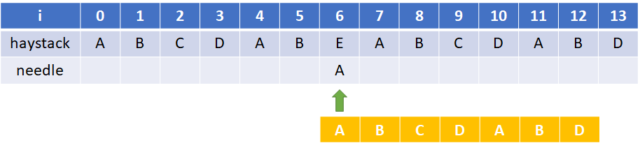
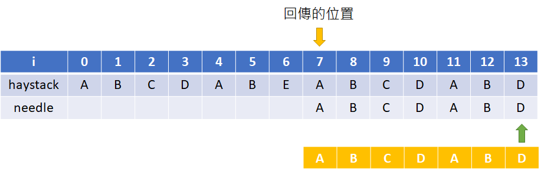

# LeetCode
不定時緩慢更新 
以猴子都能懂，淺顯易懂描述，圖像化教學，將自己解題思維呈現

## #1 Two Sum
### 目標
從nums陣列中找出兩個元素相加等於target的位置，回傳[pos1,pos2]。 
(這邊事先假設一定找的到)
### 解題策略
由於n個元素，兩兩一組(不能跟自己一組)，一共有 (n-1)+(n-2)+...+2+1 個可能， 
所以利用兩層迴圈將i與j相加依序比對target是否滿足，也就是依序 (0,1)、(0,2)、...、(0,n-1)、(1,2)、(1,3)、...、(n-1,n-2) 比對。

## #28 Implement strStr()
### 目標
從字串haystack中找出第一個needley字串的位置，如果找不到，回傳-1。
### 解題策略
這邊將採取KMP演算法實現 
詳細內容可參考 
<https://zh.wikipedia.org/zh-tw/KMP%E7%AE%97%E6%B3%95> 
此字串尋找演算法優點在於，欲搜尋的詞在不匹配時本身就包含足夠的資訊來確定下一個匹配可能的開始位置，利用這一特性以避免重新檢查先前配對的字元。 

以下是"失配函式"所需預先建立的表
$
f(j)=\left\{ 
\begin{array}{l}
  -1 \\ 
  f^m(j-1)+1 \\ 
  -1
\end{array}
\begin{array}{l}
  if\ j = 0 \\ 
  where\ m\ is\ the\ least\ integer\ k\ for\ which\ p_{f^k(j-1)+1}=p_j\\ 
  if\ there\ is\ no\ k\ satisfying\ the\ above
\end{array}
\right. \\
$
$
f^1(j)=f(j)\ and\ f^m(j)= f(f^{m-1}(j))
$

範例: 
haystack為主文字串，needle為匹配字串 
假設 haystack = "ABCDABEABCDABD"、needle = "ABCDABD" 
先將needle字串，利用失配函式產生"部分匹配表"如下 

i | 0 | 1 | 2 | 3 | 4 | 5 | 6
-|-|-|-|-|-|-|-
needle[i] | A | B | C | D | A | B | D
F[i] | -1 | 0 | 0 | 0 | 0 | 1 | 2

第一次比對(i=0) (沒問題) 
 

第二次比對(i=1) (沒問題) 
 

...到第六次比對(i=5) (沒問題) 
 

第七次比對(i=6) (配對不正確) 

這邊很關鍵，錯了該怎麼辦 
如果先依照原始做法會如下圖，從(i=1)開始出發比對 
 
但這樣不覺得其實沒必要嗎，其實已經有某些資訊提供了，仔細觀察下圖
 
 
在橘色區域，其實我們在過去比對已經會知道那邊有重複，所以直接從needle[2]開始比對即可。 
 

如果不清楚橘色區域怎麼尋找，可以下面這張圖，這就是"失配函式"所想表達的處理方式 
 

所以最後才會如下圖，從needle[2]開始比對 
 

那"失配函式表"要怎麼看才知道會是在2呢，
i | 0 | 1 | 2 | 3 | 4 | 5 | 6
-|-|-|-|-|-|-|-
needle[i] | A | B | C | D | A | B | D
F[i] | -1 | 0 | 0 | 0 | 0 | 1 | 2

當初在i=6時，neeedle[6]以'D'比對發現錯誤，藉由F[6]我們就可以找到2囉 
所以"失配函式表"就是這樣用的! 
至於"失配函式表"製作方式就要認真研究最上方貼的函式囉~ 

之後一樣，在i=6時比對錯誤，我們找到F[2] = 0，所以下一次要從needle[0]的位置進行比對，如下圖所示 
 
 

最後結果圖如下，完成最後比對，如果有找到就停下，回傳位置在哪，沒有則回傳-1
 